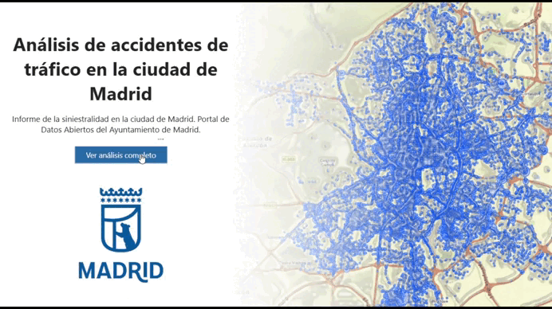

# 📊 Análisis de Accidentes e Intensidad de Tráfico en Madrid (2023-2025)

### 📖 Descripción del Proyecto
Este proyecto analiza de forma conjunta la **siniestralidad vial y la movilidad urbana en la ciudad de Madrid** durante el periodo comprendido entre 2023 y 2025. A partir de la integración de dos fuentes de datos masivas (el registro histórico de accidentes de la Policía Municipal y las mediciones de intensidad de tráfico del Ayuntamiento de Madrid), el proyecto busca superar el análisis descriptivo tradicional. 

El objetivo principal es el cálculo de un **ratio de riesgo** mediante el cruce de los accidentes con el volumen de tráfico real en cada distrito y franja horaria. Este enfoque permite identificar "puntos negros" temporales y geográficos donde, a pesar de existir menor tráfico, la probabilidad de sufrir un accidente es desproporcionalmente mayor.

### 🗂 Estructura del Proyecto
El flujo de datos se organiza de la siguiente manera para facilitar el procesamiento y su ingesta en Power BI:

```text
├── Datos_iniciales/
│   ├── Accidentalidad_Madrid/         # Archivos CSV históricos de accidentes
│   └── Trafico_Madrid/                # Histórico de intensidad de tráfico en ZIP
├── Datos_procesados/
│   ├── Accidentes_y_Trafico_Unificados.csv # Dataset consolidado para análisis en Python
│   └── Para_Power_BI/                 # Tablas de hechos para el modelo de datos
│       ├── Hechos_Accidentes.csv      # Detalles de cada suceso
│       ├── Hechos_Personas.csv        # Perfiles de los implicados
│       └── Hechos_Trafico.csv         # Intensidad vehicular máxima por suceso
├── Cuadernos_y_Scripts/               # Procesamiento de datos (Pandas, Folium, mlxtend)
├── Dashboard/                         # Archivo de visualización operativa en Power BI
└── README.md                          # Descripción general del proyecto
```

### 🛠 Instalación y Requisitos
Para replicar el entorno de trabajo y el análisis estadístico y geoespacial, es necesario descargarse los archivos de intensidades de tráfico de la web https://datos.madrid.es/dataset/208627-0-transporte-ptomedida-historico/downloads, utilizar **Python 13.0 o superior** y las siguientes librerías:
* **Manipulación de datos:** `pandas`, `numpy` (implícito), `glob`, `os`, `zipfile`, `datetime`, `time`.
* **Visualización:** `matplotlib`, `seaborn`.
* **Procesamiento Geoespacial:** `folium`, `pyproj`.
* **Modelado y Patrones:** `mlxtend` (algoritmo Apriori).
* **Dashboard Operativo:** Power BI.

### 📊 Resultados y Conclusiones
Tras el saneamiento y análisis de **más de 148.000 registros de implicados** y casi **63.000 accidentes**, los hallazgos principales son:

* **Picos de riesgo:** Los accidentes coinciden con las horas punta (08:00 y 14:00-18:00), aunque existe una criticidad atípica de madrugada (03:00-07:00) vinculada a factores de comportamiento.
* **Concentración geográfica:** Puente de Vallecas (>4.500 casos), Carabanchel y Chamartín son los distritos con mayor siniestralidad; Moratalaz y Barajas se mantienen como los más seguros.
* **Paradoja de seguridad:** El 72% de los incidentes ocurren con clima despejado, lo que indica que la visibilidad óptima reduce la percepción del riesgo y aumenta el exceso de confianza.
* **Perfil del Implicado:** El tramo demográfico de **15 a 24 años muestra una incidencia notable durante intensidades de tráfico bajas**. Adicionalmente, las combinaciones de mayor propensión a ingresos hospitalarios graves (>24 horas) involucran a peatones junto con autobuses, motocicletas de gran cilindrada y personas mayores de 70 años. Y en general hay una predominancia masculina (57%).
* **Mecanismo de colisión:** Las colisiones fronto-laterales y alcances representan el 50% del total de los registros analizados.
* **Escalabilidad:** El modelo procesa >50.000 registros, permitiendo la integración de futuros datos anuales para monitorizar la evolución de la seguridad vial en Madrid.



### 🔄 Próximos Pasos
* **Optimización de Recursos:** Se propone que las autoridades locales dirijan sus recursos de seguridad y vigilancia hacia las franjas horarias de madrugada y distritos con mayor ratio de riesgo (como Puente de Vallecas y Carabanchel), en lugar de basarse únicamente en volúmenes absolutos.
* **Campañas de Concienciación:** Se propone desarrollar campañas específicas orientadas a los colectivos de mayor riesgo, en particular, conductores jóvenes y usuarios de motocicletas.
* **Escalabilidad del Modelo:** Mantener y automatizar este sistema de datos cruzados para monitorizar la evolución de la seguridad en Madrid en futuros informes anuales.

### 🤝 Contribuciones
Las contribuciones son bienvenidas. Si deseas realizar mejoras en la calidad del cruce de datos espaciales o añadir nuevos análisis, por favor abre un *pull request* o una *issue* en este repositorio.

### ✒ Autores
* **Miguel Sanz** - Desarrollador Principal y Analista de Datos.